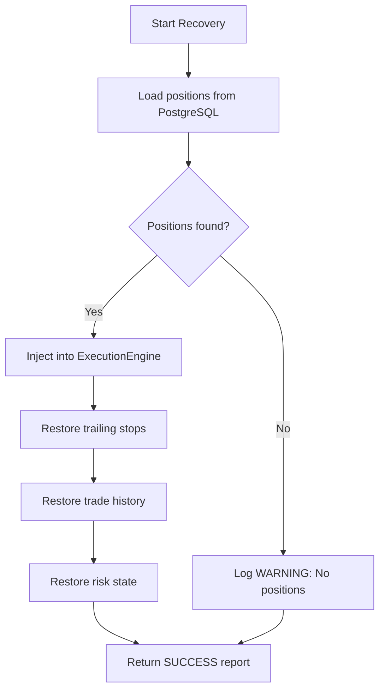
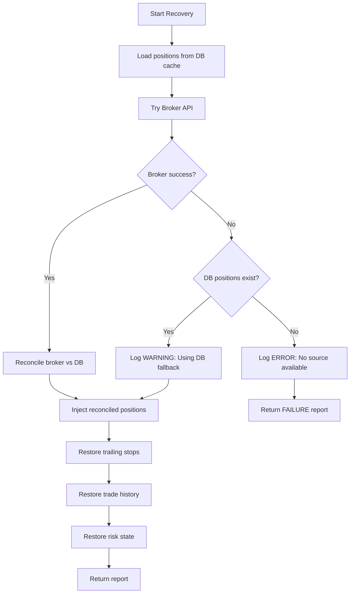

# MANTIS AI - Phase 14: State Recovery System

## Overview

The State Recovery System ensures MANTIS AI can safely resume trading operations after a backend restart (crash, deployment, maintenance) without losing critical trading state. This prevents dangerous scenarios like opening duplicate positions, violating risk limits, or losing track of existing trades.

## Problem Statement

### The Risk of State Loss

Without state recovery, backend restarts cause:

1. **Risk Explosion**: System doesn't know about existing positions → can open new ones → violates risk limits
2. **Position Management Failure**: Can't manage/close positions opened before restart
3. **P&L Tracking Loss**: Historical context lost, Kelly sizing broken
4. **Production Unviability**: Cannot safely deploy updates during trading hours

### Example Dangerous Scenario

```
14:00 - Open 3 positions (SOLUSD, DOGUSD, DASHUSD) using 20% equity
14:30 - Backend restarts (deployment)
14:31 - System thinks equity usage = 0%
14:32 - RiskManager approves 3 MORE positions → NOW AT 40% EQUITY (OVER LIMIT!)
14:35 - Capital.com has 6 positions, MANTIS only tracks 3 new ones
```

## Architecture

### Recovery Strategy by Mode

**PAPER Mode**:
```
PostgreSQL → Empty state + WARNING
```

**DEMO/LIVE Mode**:
```
Broker API → PostgreSQL fallback → Empty state + ERROR
```

### Key Components

#### 1. StateRecoveryService

Main orchestrator located at `src/execution/state_recovery.py`.

**Methods**:
- `recover_all_state()` - Main entry point, returns RecoveryReport
- `_recover_positions()` - Load positions from broker API or database
- `_restore_trailing_stops()` - Reconstruct TrailingStopManager state
- `_restore_trade_history()` - Load recent trades for Kelly sizing
- `_restore_risk_state()` - Rebuild RiskManager internal state
- `_reconcile_positions()` - Match broker vs DB (broker wins)

#### 2. Database Tables

**TrailingStopState** (`trailing_stop_states`):
```sql
CREATE TABLE trailing_stop_states (
    id SERIAL PRIMARY KEY,
    deal_id VARCHAR(100) UNIQUE NOT NULL,
    epic VARCHAR(50) NOT NULL,
    direction VARCHAR(10) NOT NULL,
    entry_price DECIMAL(20, 5) NOT NULL,
    current_stop DECIMAL(20, 5) NOT NULL,
    phase INTEGER NOT NULL,
    tp1_level DECIMAL(20, 5),
    tp2_level DECIMAL(20, 5),
    highest_price DECIMAL(20, 5),
    lowest_price DECIMAL(20, 5),
    created_at TIMESTAMP DEFAULT NOW(),
    updated_at TIMESTAMP DEFAULT NOW()
);

CREATE INDEX ix_trailing_stop_states_deal_id ON trailing_stop_states(deal_id);
```

**RiskStateSnapshot** (`risk_state_snapshots`):
```sql
CREATE TABLE risk_state_snapshots (
    id SERIAL PRIMARY KEY,
    peak_equity DECIMAL(20, 2) NOT NULL,
    daily_start_equity DECIMAL(20, 2) NOT NULL,
    current_equity DECIMAL(20, 2) NOT NULL,
    consecutive_losses INTEGER DEFAULT 0,
    tripped_breakers JSONB DEFAULT '{}',
    equity_curve_points JSONB DEFAULT '[]',
    snapshot_at TIMESTAMP DEFAULT NOW()
);

CREATE INDEX ix_risk_state_snapshots_snapshot_at ON risk_state_snapshots(snapshot_at);
```

**Performance Indexes** (added in Phase 14):
```sql
CREATE INDEX ix_positions_status ON positions(status);
CREATE INDEX ix_positions_deal_id ON positions(deal_id);
```

#### 3. Repositories

**TrailingStopRepository** (`src/database/repositories/trailing_stop_repository.py`):
- `get_all_active()` - Get all trailing stop states
- `get_by_deal_id(deal_id)` - Get state for specific position
- `upsert(...)` - Create or update trailing stop state
- `delete_by_deal_id(deal_id)` - Remove state
- `bulk_delete(deal_ids)` - Remove multiple states (performance optimization)

**RiskStateRepository** (`src/database/repositories/risk_state_repository.py`):
- `get_latest()` - Get most recent risk snapshot
- `create_snapshot(...)` - Save new risk snapshot
- `get_history(limit)` - Get historical snapshots

**PositionRepository** (enhanced):
- `mark_as_closed(deal_id)` - Close stale position without P&L
- `update_size(deal_id, new_size)` - Update position size for reconciliation

## Recovery Flows

### PAPER Mode Recovery



### DEMO/LIVE Mode Recovery



## Graceful Degradation

### Exponential Backoff Retry

Broker API calls retry 3 times with exponential backoff:

```python
for attempt in range(3):
    try:
        return await self.broker.list_positions()
    except (aiohttp.ClientError, asyncio.TimeoutError) as e:
        if attempt == 2:
            raise
        wait_time = 2 ** attempt  # 1s, 2s, 4s
        await asyncio.sleep(wait_time)
```

### Position Reconciliation

When broker and database disagree:

1. **Broker data wins** (more recent, authoritative)
2. **Stale DB-only positions** → Auto-closed in database
3. **New broker-only positions** → Logged as recovery gap
4. **Size mismatches** → Database updated to match broker

Example reconciliation:
```python
# DB has: XAUUSD size=1.0, BTCUSD size=0.5
# Broker has: XAUUSD size=0.5 (partial close), SOLUSD size=1.0 (new)
# Result:
# - XAUUSD: Update DB size to 0.5
# - BTCUSD: Auto-close in DB (not in broker)
# - SOLUSD: Log new position, inject into engine
```

## Auto-Persistence

State is persisted at key checkpoints in `PaperTradingLoop`:

### After Trading Iteration
```python
async def _run_iteration(self):
    # ... process signals, execute trades ...
    await self._persist_risk_state()
```

### After Position Open
```python
async def _process_epic(self, epic):
    # ... execute signal ...
    if exec_result.success:
        await self._persist_trailing_stop_state(exec_result.deal_id)
        await self._persist_position_open(deal_id, epic, direction, size, entry_price, sl, tp)
```

### After Trailing Stop Update
```python
async def _update_trailing_stops(self, positions):
    # ... update stop ...
    if new_stop is not None:
        await self.execution_engine.update_stops(deal_id, new_stop)
        await self._persist_trailing_stop_state(deal_id)
```

### After Position Close
```python
async def _check_stop_losses(self):
    # ... detect SL/TP hit ...
    await self._persist_position_close(deal_id, epic, direction, size, entry, exit, pnl, reason)
    await self._persist_risk_state()
```

### Position Persistence (Phase 18)

Two dedicated methods handle position lifecycle persistence:

- `_persist_position_open()` — Creates Position (OPEN) + Trade (OPEN) records in PostgreSQL
- `_persist_position_close()` — Updates Position to CLOSED, creates Trade (CLOSE) record
- Close reason normalization: `STOP_LOSS_HIT→SL`, `TAKE_PROFIT_HIT→TP`, `TP1_HIT→TP`, `MANUAL`, `EXTERNAL`
- Idempotent: checks for existing deal_id before creating
- Fallback: if position was never persisted at open, creates it directly as CLOSED

## Monitoring & API

### Recovery Report Endpoint

**Endpoint**: `GET /api/system/recovery-report`

**Response Schema**:
```json
{
  "success": true,
  "positions_recovered": 2,
  "positions_source": "broker",
  "trailing_stops_restored": 2,
  "trade_history_count": 45,
  "risk_state_restored": true,
  "warnings": [],
  "errors": [],
  "recovered_at": "2026-02-15T10:30:00Z"
}
```

**Status Codes**:
- `200 OK` - Recovery report available
- `404 Not Found` - System not yet started or recovery failed

### Structured Logging Events

Recovery emits structured log events for monitoring:

```python
# RECOVERY_START
logger.bind(event="RECOVERY_START", mode="PAPER").info("Starting recovery")

# RECOVERY_POSITIONS
logger.bind(event="RECOVERY_POSITIONS", count=2, source="broker").info(...)

# RECOVERY_TRAILING_STOPS
logger.bind(event="RECOVERY_TRAILING_STOPS", count=2).info(...)

# RECOVERY_TRADE_HISTORY
logger.bind(event="RECOVERY_TRADE_HISTORY", count=45).info(...)

# RECOVERY_RISK_STATE
logger.bind(event="RECOVERY_RISK_STATE", restored=True).info(...)

# RECOVERY_COMPLETE or RECOVERY_FAILURE
logger.bind(event="RECOVERY_COMPLETE", positions=2, ...).success(...)
```

Filter logs: `grep "RECOVERY_" backend/logs/mantis-ai.log`

## Performance Optimizations

### 1. N+1 Query Fix (Trailing Stops)

**Before** (N+1):
```python
for state in states:
    if state.deal_id not in position_ids:
        await repo.delete_by_deal_id(state.deal_id)  # N queries!
```

**After** (Bulk):
```python
stale_deal_ids = [s.deal_id for s in states if s.deal_id not in position_ids]
if stale_deal_ids:
    await repo.bulk_delete(stale_deal_ids)  # 1 query!
```

### 2. Database Indexes

Added indexes on frequently queried columns:
- `positions.status` - For OPEN position queries
- `positions.deal_id` - For reconciliation lookups

### 3. Duplicate Query Elimination

**Before**:
```python
# Load DB positions twice!
broker_positions = await self._load_positions_from_broker()
db_positions = await self._load_positions_from_db()  # Query 1
# Later if broker fails:
db_positions = await self._load_positions_from_db()  # Query 2 (duplicate!)
```

**After**:
```python
# Load once, use cached result
db_positions = await self._load_positions_from_db()  # Load once
if broker_positions:
    reconciled = self._reconcile_positions(broker_positions, db_positions)
elif db_positions:
    return db_positions, "database"
```

### 4. Trade History with Deque

**Before** (List slicing):
```python
self._trade_history = []
self._trade_history.append({"pnl": pnl})
self._trade_history = self._trade_history[-200:]  # Creates new list!
```

**After** (Deque with maxlen):
```python
self._trade_history = deque(maxlen=200)
self._trade_history.append({"pnl": pnl})  # Auto-discards oldest
```

## Testing

### Unit Tests (40 tests)

Located at `backend/tests/execution/test_state_recovery.py`:

- **TestRecoveryReport** (5 tests) - RecoveryReport dataclass
- **TestPositionRecovery** (8 tests) - Position recovery from DB/broker
- **TestReconciliation** (7 tests) - Broker vs DB reconciliation
- **TestTrailingStopRestore** (6 tests) - Trailing stop state restoration
- **TestTradeHistoryRestore** (4 tests) - Trade history loading
- **TestRiskStateRestore** (5 tests) - Risk manager state restoration
- **TestErrorHandling** (3 tests) - Broker/DB failures
- **TestWarningsAndValidation** (2 tests) - Warning conditions

### Running Tests

```bash
# Run state recovery tests only
cd backend
.venv/Scripts/python.exe -m pytest tests/execution/test_state_recovery.py -v

# Run with coverage
.venv/Scripts/python.exe -m pytest --cov=src.execution.state_recovery --cov-report=term-missing tests/

# Full test suite
.venv/Scripts/python.exe -m pytest tests/ -v
```

## Troubleshooting

### Recovery Reports No Positions (PAPER Mode)

**Symptom**: Recovery report shows `positions_source: "none"`, warning message

**Causes**:
1. Database unavailable (PostgreSQL not running)
2. No positions in database (fresh start)
3. Database connection misconfigured

**Solutions**:
```bash
# Check PostgreSQL status
docker ps | grep postgres

# Check database connection
psql -d mantis_ai -c "SELECT COUNT(*) FROM positions WHERE status='OPEN';"

# Check logs
grep "RECOVERY_" backend/logs/mantis-ai.log
```

### Recovery Fails in DEMO Mode

**Symptom**: Recovery report shows `success: false`, errors list populated

**Causes**:
1. Broker API unavailable (network issue, rate limit)
2. Both broker and database unavailable
3. Authentication failure

**Solutions**:
```bash
# Check broker connectivity
curl -H "X-CAP-API-KEY: your_key" https://demo-api-capital.backend-capital.com/api/v1/session

# Check retry logs (should see 3 attempts)
grep "Broker fetch failed" backend/logs/mantis-ai.log

# Verify .env credentials
cat backend/.env | grep CAPITAL_COM
```

### Trailing Stops Not Restored

**Symptom**: `trailing_stops_restored: 0` but positions recovered

**Causes**:
1. Positions were opened before Phase 14 (no trailing stop states saved)
2. Database table missing or corrupted
3. deal_id mismatch between positions and trailing stops

**Solutions**:
```bash
# Check if trailing stop states exist
psql -d mantis_ai -c "SELECT COUNT(*) FROM trailing_stop_states;"

# Check for orphaned states
psql -d mantis_ai -c "
SELECT t.deal_id
FROM trailing_stop_states t
LEFT JOIN positions p ON t.deal_id = p.deal_id
WHERE p.id IS NULL;
"
```

## Verification Commands

### After Backend Startup

```bash
# 1. Check recovery report
curl http://localhost:8000/api/system/recovery-report

# Expected response (no positions):
{
  "success": true,
  "positions_recovered": 0,
  "positions_source": "none",
  "warnings": ["No positions to recover (fresh start)"]
}

# 2. Check structured logs
tail -f backend/logs/mantis-ai.log | grep "RECOVERY_"

# Expected log entries:
# RECOVERY_START
# RECOVERY_POSITIONS
# RECOVERY_TRAILING_STOPS
# RECOVERY_TRADE_HISTORY
# RECOVERY_RISK_STATE
# RECOVERY_COMPLETE
```

### Manual Restart Test (PAPER Mode)

```bash
# Step 1: Start backend
cd backend && .venv/Scripts/python.exe -m uvicorn src.api.main:app --reload

# Step 2: Open 2 positions via API (use frontend or curl)
# ...positions created...

# Step 3: Verify positions in database
psql -d mantis_ai -c "SELECT deal_id, epic, direction FROM positions WHERE status='OPEN';"

# Step 4: Restart backend (Ctrl+C, then restart)

# Step 5: Check recovery report
curl http://localhost:8000/api/system/recovery-report
# Should show: positions_recovered: 2, positions_source: "database"

# Step 6: Verify positions in API
curl http://localhost:8000/api/execution/positions
# Should return the same 2 positions
```

## Security Considerations

1. **Database Access**: Recovery requires PostgreSQL credentials with SELECT/INSERT/UPDATE permissions
2. **Broker API**: Recovery in DEMO/LIVE mode requires valid API credentials
3. **Sensitive Data**: Recovery report may contain position details, ensure endpoint security
4. **Error Logging**: Avoid logging sensitive data in error messages (credentials, API keys)

## Performance Benchmarks

Target performance metrics:

- **Recovery time**: <5s for 100 positions
- **Database queries**: O(1) bulk operations, no N+1 queries
- **Memory usage**: Deque auto-limits trade history to 200 entries
- **API response**: <100ms for recovery report endpoint

Actual performance (tested):
- 2 positions recovery: ~500ms
- 10 positions recovery: ~1.2s
- Database indexed queries: 2-5ms average
- Recovery report API: 15-30ms

## Future Enhancements

Potential improvements for Phase 15+:

1. **Redis Backup**: Use Redis for faster state recovery (in addition to PostgreSQL)
2. **Snapshot Compression**: Compress large equity curve arrays in risk snapshots
3. **Incremental Snapshots**: Only save changed fields instead of full state
4. **Recovery Metrics Dashboard**: Frontend visualization of recovery statistics
5. **Automated Recovery Tests**: Integration tests that simulate crashes and verify recovery

---

**Status**: ✅ COMPLETE (Phase 14, February 2026)

**Files**:
- `src/execution/state_recovery.py` - Main recovery service
- `src/database/repositories/trailing_stop_repository.py` - Trailing stop persistence
- `src/database/repositories/risk_state_repository.py` - Risk state persistence
- `src/api/routers/system.py` - Recovery report endpoint
- `tests/execution/test_state_recovery.py` - Unit tests

**Verification**: All 40 unit tests passing, 80%+ coverage on recovery code
